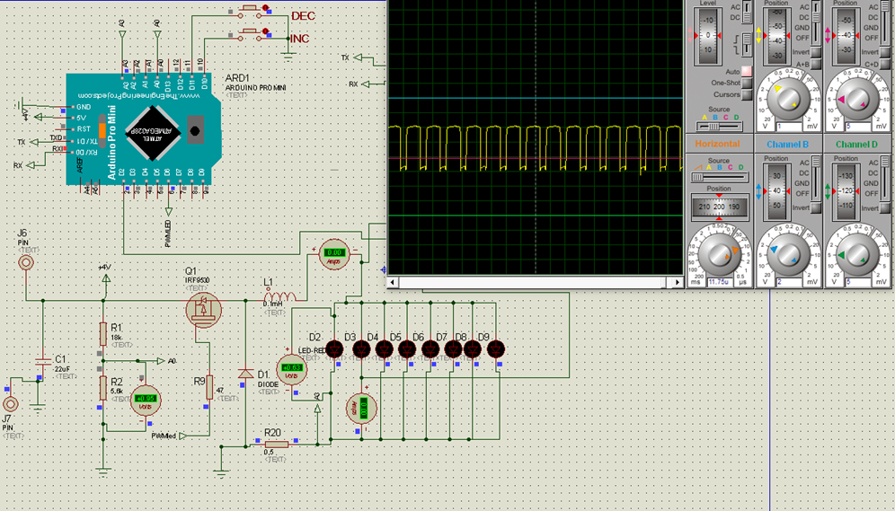

#Projet de régulation d'une LED de puissance via un ARDUINO
## Carte utilisée: ARDUINO PRO MINI (ATMEGA 328)

Le sujet proposé a pour but de réguler une LED de puissance afin d'obtenir, quel que soit le niveau de la batterie, pour avoir un éclairage d'intensité constante.
    
I) Boucle ouverte :

Pour commencer le projet nous débutons avec la boucle ouverte qui a pour but de faire fonctionner la LED avec différents modes, que ce soit d’intensité comme de de fonctionnement (clignotant, continu), cela en essayant d’avoir une consommation la plus réduite possible.

Le 1er objectif qu’on se fixe sur cette partie est de piloter la PWM afin de commander la LED. On a donc commencé par faire un programme simple :

```dart
include <Arduino.h>
#define PWM 6
void setup() {  
pinMode(PWM,OUTPUT);
TCCR0B = (TCCR0B & 0b11111000) | 0x01; //Assignation du Timer 0 à la PWM
(64Khz)
}

void loop(){
analogWrite(PWM,127) ; // Pilotage de la sortie PWM avec un rapport 
//cyclique de 0.5. En effet les valeurs possibles pour la PWM sont comprises 
//entre 255 et 0 où à 255 la PWM est à l’arrêt et à 0 le rapport cyclique 
//est de 1.
}

```
On obtient lors de la simulation de ce programme :

On récupère ici la tension de sortie de la PWM.


Le 2nd objectif est d’améliorer le premier afin d’y intégrer un mode clignotant en plus du mode continu. Pour cela nous avons eu l’idée d’utiliser une interruption du timer 1 pour compter afin d’obtenir 50 ms allumé pour 950ms éteint. En plus on veut rajouter une fonction permettant de changer la valeur de la PWM afin d’avoir différentes intensité (Autant courant que lumineux). Cette fonction sera activable via un bouton poussoir et un autre sera utiliser pour passer du mode continu au mode clignotant.

Programme:


```dart
#include <Arduino.h>
#include <TFT_eSPI.h>
#include <TimerOne.h>
#include <LowPower.h>

#define PWM 6
#define BPR 10
#define BPM 11
#define TG 2
int count=0;
int m=1,n=1;
int speed=127;
int p=0,p2=0;
   
   
void Tint() { //programme D'interruption pour compter
switch (n){// Mode cligno et continu

case 1:    count++;
if (count<95){
    analogWrite(PWM,255);
}

if (count >=95 && count <98){
    analogWrite(PWM,speed);
}
if(count>98){
    count=0;
    } Serial.println(speed);break;

case 2:
analogWrite(PWM,speed);
Serial.println(speed);
break;


}
}


void setup() {  
    Serial.begin(19200);
pinMode(PWM,OUTPUT);
pinMode(BPR,INPUT_PULLUP);
pinMode(BPM,INPUT_PULLUP);
pinMode(TG,OUTPUT);
Timer1.initialize(10000);           // initialize timer1, and set a 0,1 second period =>  100 000  pour 0.01s  10 000
Timer1.attachInterrupt(Tint);

TCCR0B = (TCCR0B & 0b11111000) | 0x01; //64kHz Timer 0

}

void loop(){
if (digitalRead(BPM) ==LOW ) {
p++;
if (p>=75){
m++;                  //incrementation des modes 
if (m>3) m=1;

switch (m) {
case 1:speed=127;   break;
case 2:speed=195;   break;
case 3:speed=240;   break;
}
p=0;
}

}
if (digitalRead(BPR) == LOW  ) {
p2++;
if (p2>=75){
n++;                  //incrementation des modes 
if (n>2) n=1;
p2=0;
}
}

  
}

```
Ce programme fonctionne très bien en boucle ouverte mais possède tout de même des limites qui vont nous empêcher de l'utiliser dans notre quête de basse consommation et de régulation.